---
title: "Unity初心者向けピンボールゲームチュートリアル"
free: false
---

この資料では、Unityを使って2Dピンボールゲームを作りながら、ゲームオブジェクトとコンポーネントの基本を学びます。

Unityでのゲーム開発で最初に理解したいことは、GameObject（ゲームオブジェクト）とComponent（コンポーネント）の関係です。シーン内にゲームオブジェクトを配置し、そこへコンポーネントをアタッチすることで、表示・物理・音・スクリプトによる振る舞いを追加できます。

# Chapter 0 Unityをインストールしよう

## この章のゴール
- Unity Hubをインストールする
- Unity EditorのLTS版をインストールする
- Visual StudioのUnity開発環境を準備する

## Unityをインストールしよう（Windowsの場合）
Unityをインストールしましょう。

Macの場合は下記のサイトなどを参考に。
@[card](https://techchance.jp/blog/2023/01/03/how_to_introduce_nity/)
こちらは、アカウント作成、ライセンス認証周りも丁寧に解説されています。Windowsの場合も困ったら見てみてください。

毎回困る予測変換周りの設定方法がまとめられています。
@[card](https://zenn.dev/nok_c7/articles/c9b59cf32134f2)

## UnityHubをインストール
### ダウンロード
下記サイトからUnityHubをダウンロード
https://unity.com/ja/download

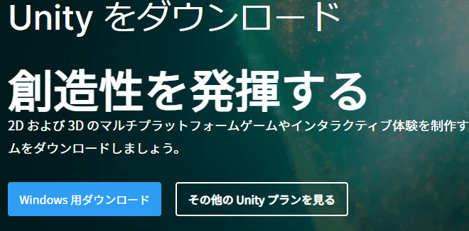

### UnityHubを起動、アップデート
アップデートがあったら、最新版に更新しておく

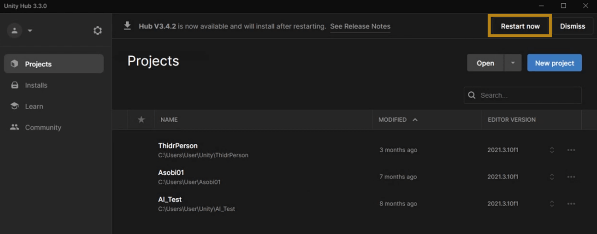

環境設定を開く

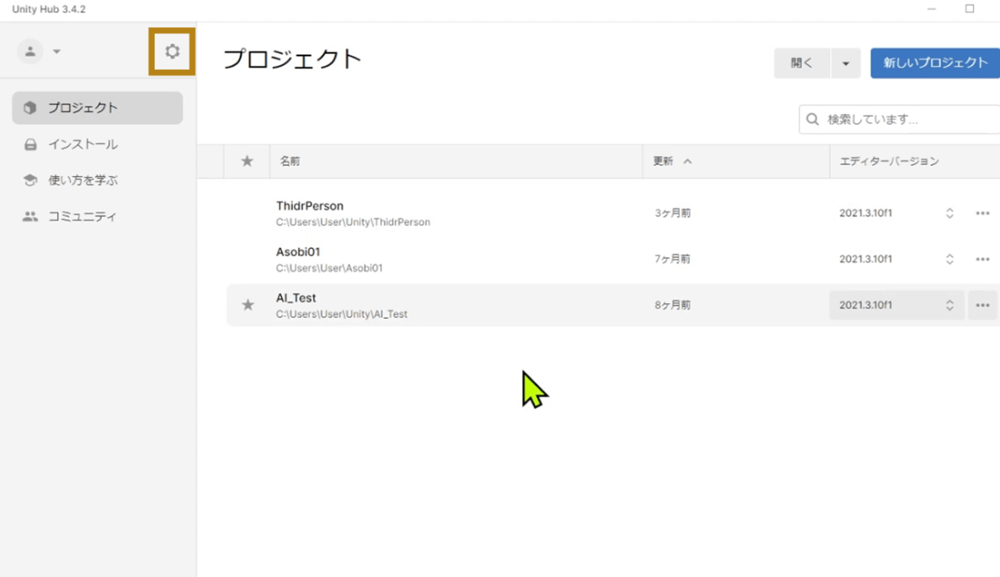

言語設定を日本語に変更（してもしなくてもいい）

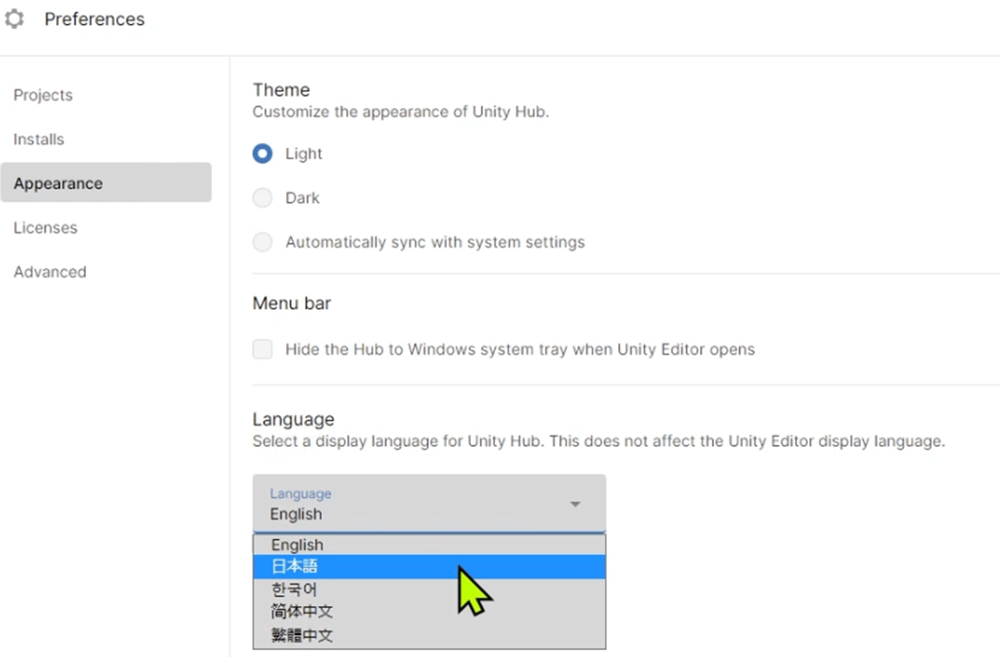

### Unityアカウントを作成してサインイン

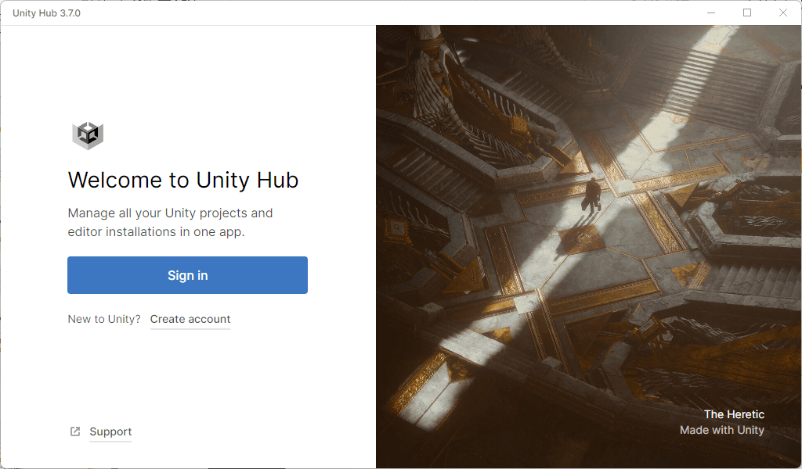

Google、Facebook、AppleID等でサインインするか、こちらでIDを作成からアカウントを作成してサインインする。

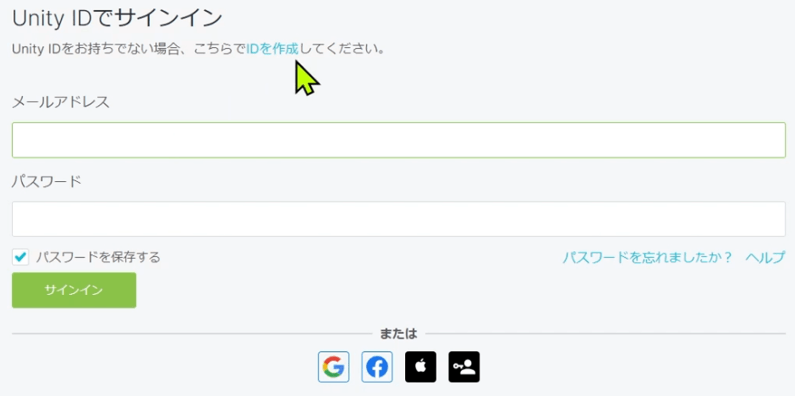

「Get Unity Personal」が表示されたら「Agree」をクリック

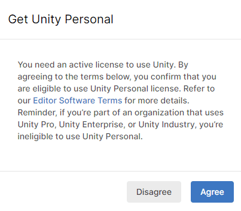

### Unityエディターをインストール
[LTS]とついているものを選択。

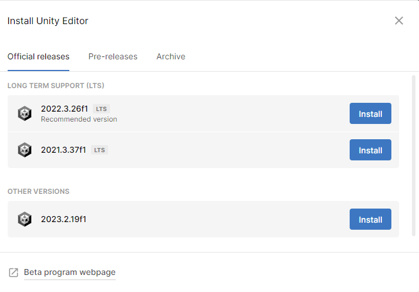

インストールをクリック
Microsoft Visual Studio Community が無ければチェックを入れる。
その他は必要に応じて、後で変更可能。Language Packの日本語は入れても入れなくても構わないが、このチュートリアルでは英語版で進める（日本語メニューより英語メニューの解説サイトが多いため）

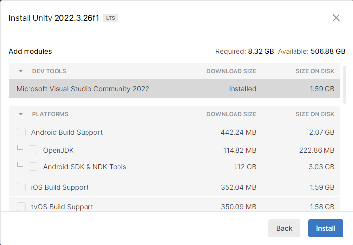

インストール終了まで待つ（1時間以上かかることもあります）。
UnityHubが最新でない場合、インストールに失敗することがあるので、UnityHubは必ずアップデートしてから行ってください。

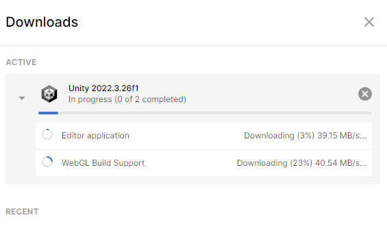

インストール完了後、[Visual Studio Installer]を起動

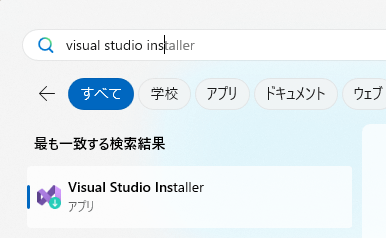

Visual Studio Community 2022の[変更]

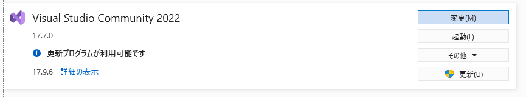

C++によるデスクトップ開発

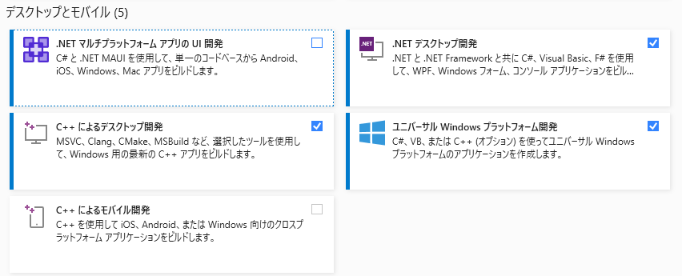

Unityによるゲーム開発、C++によるゲーム開発　にチェックを入れる

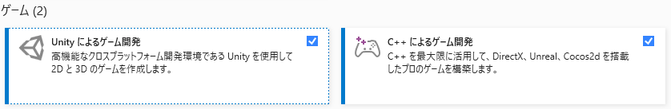

右側の、インストールの詳細で、[Windows 11 SDK]のチェックを入れる

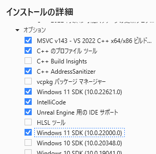

[変更]をクリックして、変更をインストール

以上でUnity起動前の設定は完了です。

## ここまでできたらOK
- Unity Hubにサインインできている
- Unity EditorのLTS版がインストール済みになっている
- Visual Studio InstallerでUnity開発に必要な項目が入っている

# Chapter 1 Unityプロジェクトを作ろう

## この章のゴール
- 2Dプロジェクトを作成する
- テンプレートファイルをインポートする
- GameObjectとComponentの考え方を知る

## このチュートリアルで作成するゲーム
Unityを使用して手軽に楽しめる2Dピンボールゲームを作成する方法を紹介します。
このチュートリアルでは、基本的なUnityの操作方法を学び、Unityにおけるゲーム開発の基本を身に付けます。

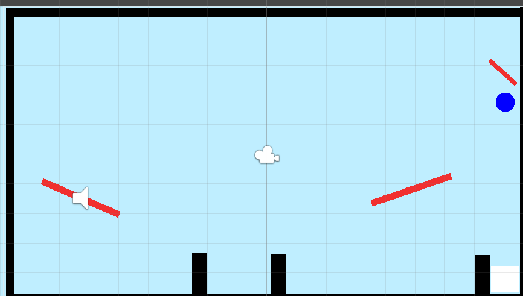

## このチャプターで行うこと
このチャプターでは、Unityプロジェクトを作成してテンプレートファイルをインポート、ピンボールゲームを作るための下準備を行います。

## 要点
Unityでのゲーム開発にあたって、最初に理解するべきことはGameObject(ゲームオブジェクト)とComponent(コンポーネント)の関係性だと思います。このチュートリアルでは、ゲームシーン内にゲームオブジェクトを配置し、ゲームオブジェクトにコンポーネントを付けることで、ゲームオブジェクトが様々な振る舞いを獲得することを学びます。

## プロジェクトを作成する
Unityで2Dプロジェクトを作成しましょう。以下の手順でプロジェクトを作成してください。
- UnityHubを起動し、[New project] ボタンから新規プロジェクトを作成

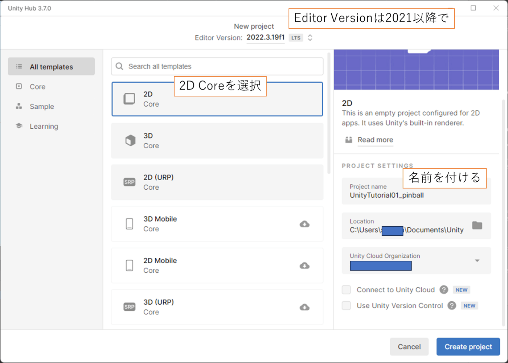

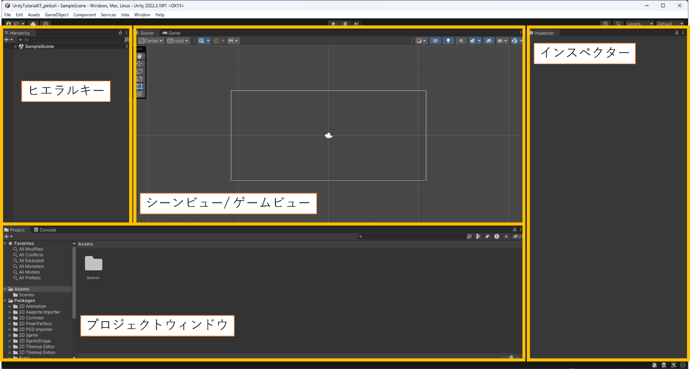

## テンプレートファイルをインポート
下記のリンクから、今回のテンプレートファイルをダウンロードしてください。
https://github.com/ksu-gamelab/Unity_tutorial/raw/main/UnityTutorial_01.unitypackage

ダウンロードしたファイル（UnityTutorial_01.unitypackage）を、インポートします。
- プロジェクトウィンドウ内の何もない場所を右クリック

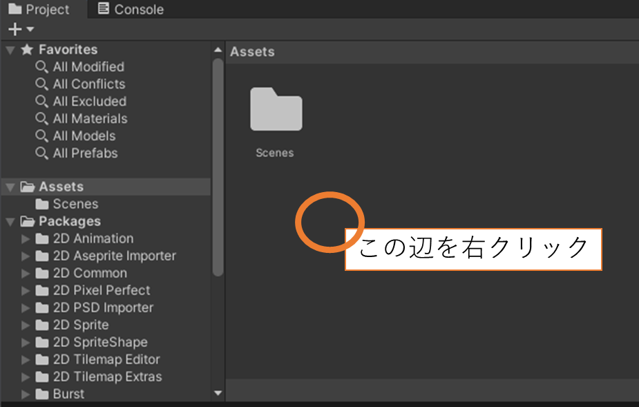

- Import Package ⇒ Custom Package とクリック

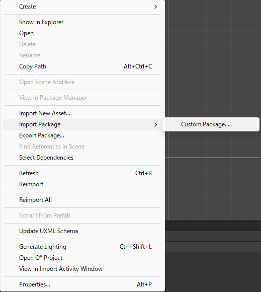

- ファイルを選択して開く

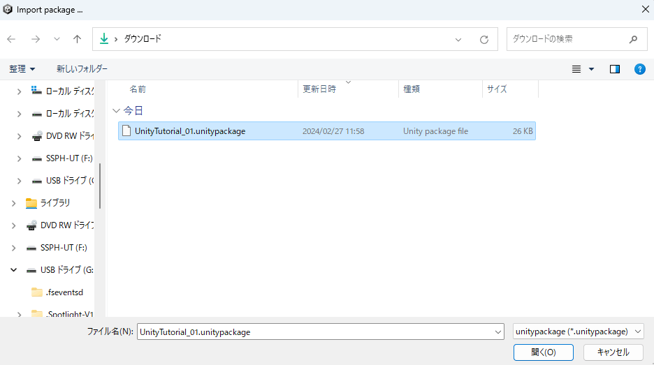

- Import Unity Package ウィンドウが開くので、 [Import]ボタンをクリック

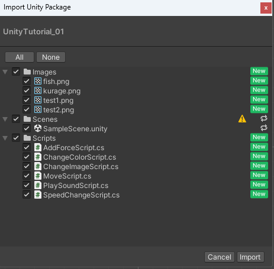

- 警告が出てくるので、 [Reload]

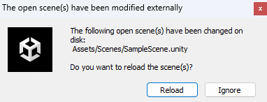

- プロジェクトウィンドウに3つのフォルダが見えたらインポート完了

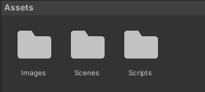

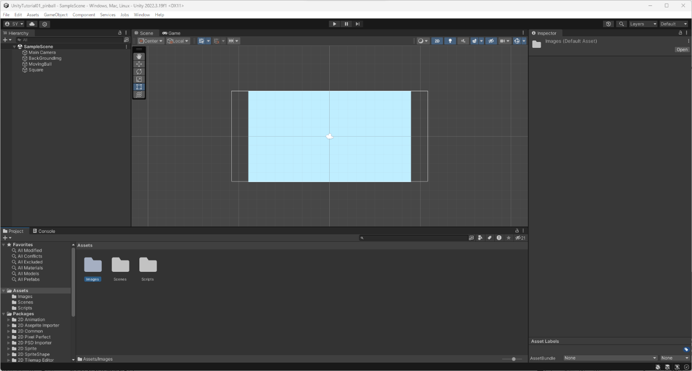

ここまで出来たら、次のチャプターに進みましょう。

## ここまでできたらOK
- Projectウィンドウにテンプレートのフォルダが表示されている
- Sceneビューに背景・ボール・四角形が表示されている
- 次章で編集するプロジェクトを開いた状態になっている

# Chapter 2 ゲームオブジェクトを作成・配置しよう

## この章のゴール
- Gameビューの画面サイズを設定する
- ゲームオブジェクトの移動・サイズ変更・回転を行う
- Spriteの表示順序と色を変更する

## このチャプターで行うこと
このチャプターでは、ゲームオブジェクトの作成と配置方法を学びます。
ゲームオブジェクトの作成、位置の変更、サイズの変更、色の変更、画像オブジェクトの表示順序の変更方法を身に付けましょう。

## ゲーム画面のサイズを変更する
- シーンビュー/ゲームビューのタブを切り替えて、[Game]ビューを表示

下記のようにクリックしていき、ゲーム画面のサイズを指定します。

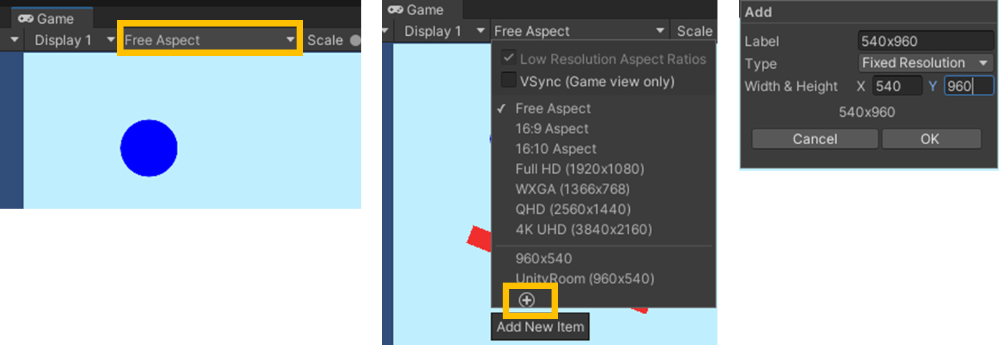

ここでは、横540, 縦960 で設定していますが、好きなサイズにして構いません。
縦画面、横画面もどちらでも問題ありません。
（横540, 縦960はUnityRoom https://unityroom.com/ で公開する際の縦画面の推奨サイズです）

画面サイズを変更したら[Scene]ビューに戻ります。
薄っすら白い四角形の線が見えています。この白い四角形内にあるものがカメラで表示されます。

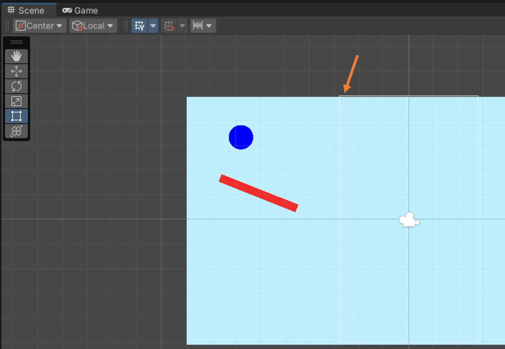

## オブジェクトの配置を変更する
### 背景画像のサイズを調整
ヒエラルキーの中から、BackGroundImgを選択

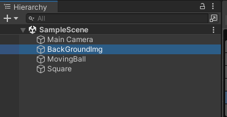

Rect Toolを選択して、

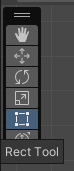

四隅の青丸をドラッグして背景画像のサイズを変更

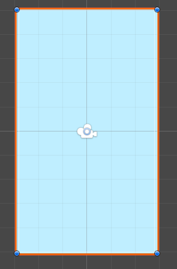

### 最初から配置されているオブジェクトを移動
テンプレートのシーンには、最初から3つのゲームオブジェクトが配置されています。
- BackGroundImg：背景画像
- MovingBall：ピンボールの玉
- Square：配置練習用の四角形

Squareを好きな位置に移動してみましょう。
Move Toolを選択して、オブジェクトを動かします。

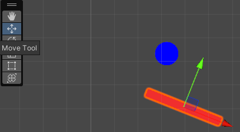

これだと画面に対してオブジェクトが大きすぎますね。サイズも調整しましょう。
オブジェクトのサイズを変更するには、先ほどのRect Toolを使います。

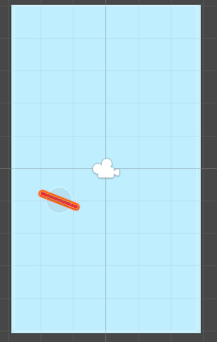

丁度いい大きさにできたら、MovingBallの位置とサイズも調整しましょう。

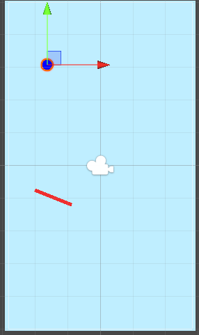

角度を変えるときには、Rotate Toolを使います。

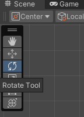

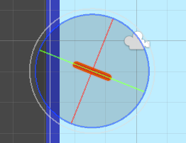

### 新しいゲームオブジェクトを追加する
最初から配置されているもの以外にもゲームオブジェクトを追加してみましょう。
ヒエラルキーの左上に＋ボタンをクリック、2D Object⇒Sprite ⇒ Square とクリックしてみてください。

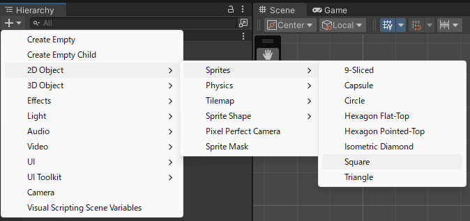

ヒエラルキーに新たなゲームオブジェクトが追加され、シーン上に四角形が一つ出現します。

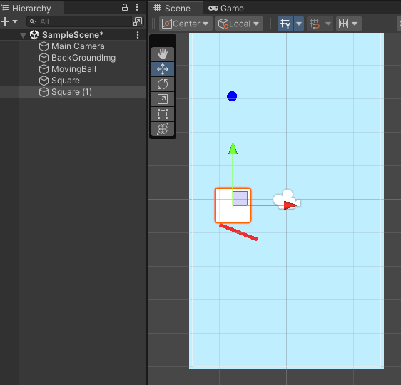

ここで一つ注意点があります。
追加したSquareですが、背景の後ろに隠れて見えなくなってしまうことがあります。
これは、Sprite（画像オブジェクト）の表示順序の問題で隠れているだけで、背景画像よりも手前に表示するように設定すれば表示されるようになります。

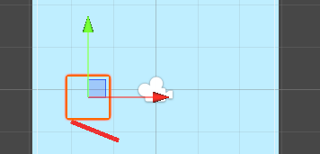

作成したゲームオブジェクトを選択して、画面右側にあるインスペクターウィンドウの設定値を変更しましょう。
[Additional Settings]内の [Order in Layer]を0から1に変更すると、背景の後ろに隠れることが無くなります。Order in Layerは数値が大きいほど手前に表示されます。上手く使えば、プレイヤーの手前に草などを配置してわざと隠したり、敵が壁に半分隠れる演出などに利用できます。

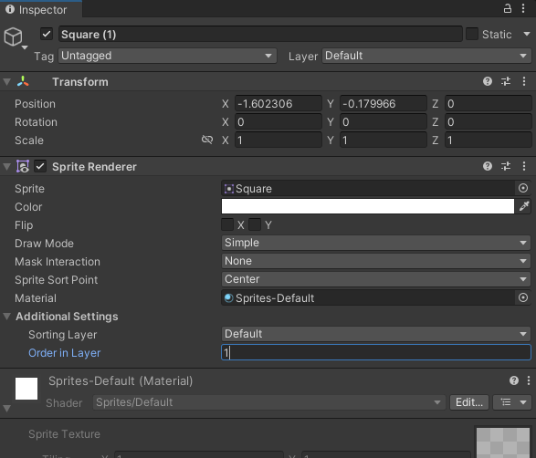

さて、オブジェクトを移動してゲーム画面の最下部に床を設置してみてください。

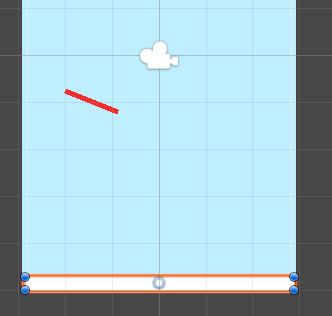

オブジェクトの色を変更するときには、[Sprite Renderer]の[Color]を変更します。

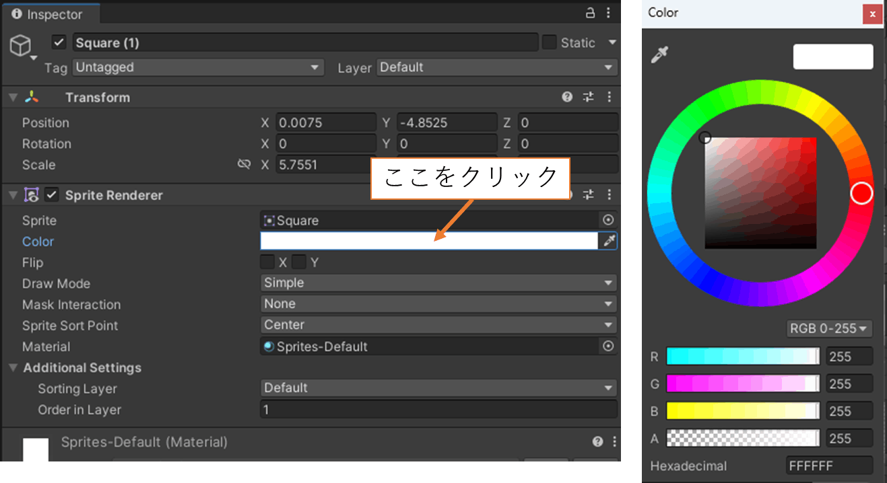

ゲームオブジェクトの名前が分かりにくいですね。
分かりやすい名前に変えてあげましょう。

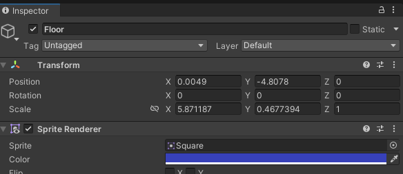

同じようにして、左右に壁も作ってみましょう。

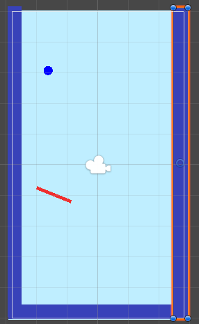

これでピンボールゲームの外枠が出来ました。ここまで出来たら次のチャプターに進みましょう。

## ここまでできたらOK
- 背景画像がカメラ範囲に合う大きさになっている
- 床・左右の壁が配置されている
- 追加したSpriteが背景に隠れず表示されている

# Chapter 3 コンポーネントをアタッチしよう

## この章のゴール
- Rigidbody2Dでボールを落下させる
- Collider2Dで当たり判定を付ける
- 独自Scriptコンポーネントで回転する動きを追加する

## このチャプターで行うこと
このチャプターでは、オブジェクトにコンポーネントをアタッチし、新たな性質を与える方法を学びます。

## ゲームを実行する
ここで一度ゲームを実行してみましょう。
画面上部にある、三角ボタンでゲーム開始、もう一度押せば終了です。

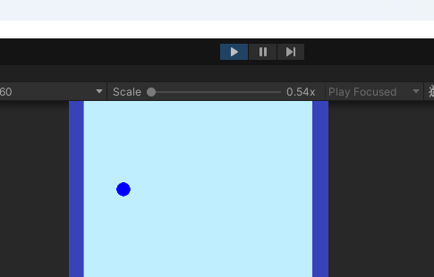

・・・何も起こりませんね。

（Unityでは実行中に行った変更は保存されません。実行したら必ず終了するように気を付けましょう。）

## ゲームオブジェクトにコンポーネントをアタッチ
実行しても何も起こらないのは、配置したゲームオブジェクトが「動く」性質を持っていないからです。ゲームオブジェクトに「動き」（振る舞い）を与えるためには、ゲームオブジェクトにコンポーネントをアタッチする必要があります。

### ボールに落下する性質を与える（Rigidbody2D）
MovingBallに[Rigidbody2D]というコンポーネントをアタッチしてみましょう。
ヒエラルキーでMovingBallを選択し、MovingBallのインスペクターを開きます。

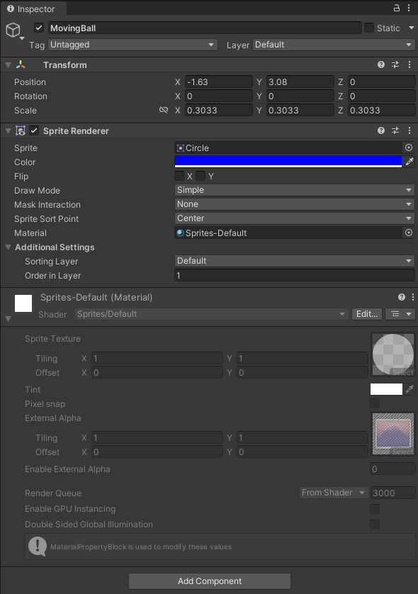

インスペクターの一番下に、[Add Component]のボタンがあります。クリックして、検索欄に「Rigidbody2D」と入力すると、Rigidbody2Dのコンポーネントが出てきます。

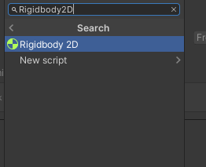

これをクリックすると、MovingBallのインスペクターにRigidbody2Dコンポーネントが追加されます。

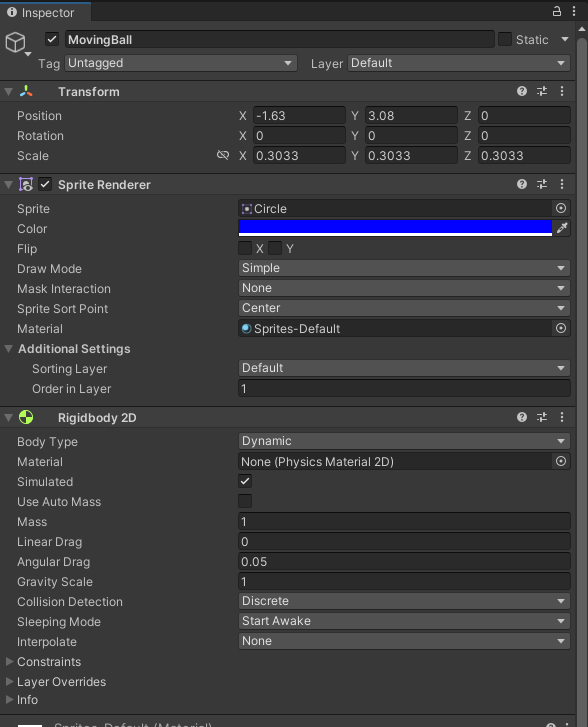

追加出来たらもう一度実行してみてください。

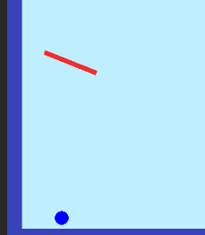

今度はボールが落下しましたね。
MovingBallのゲームオブジェクトにRigidbody2Dコンポーネントがアタッチされることによって、MovingBallに物理演算を適用する性質が追加されました。これによってボールが自然落下することになった訳です。

### オブジェクトに当たり判定を付ける
こうなってくると、ボールが床を突き抜けて落ちていくのが気になりますね。
今、ボールと床はただの画像であって、実際の形を持ったものになっていません。ただ表示されているだけのものになっています。
床のオブジェクトに物理的な衝突を表現するコンポーネントをアタッチして、ゲームオブジェクトに物理的な形状を与えましょう。ゲームで良く使われる「当たり判定」というやつです。

先ほどと同じように、MovingBallのインスペクターを開いて、今度はCircle Collider2Dのコンポーネントを追加します。Circle Collider2Dは円形の形の当たり判定です。

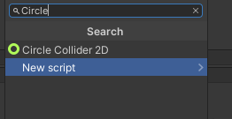

これだけだと、ボールだけが当たり判定を持っていて床には何もないので、まだ床を突き抜けてしまいます。

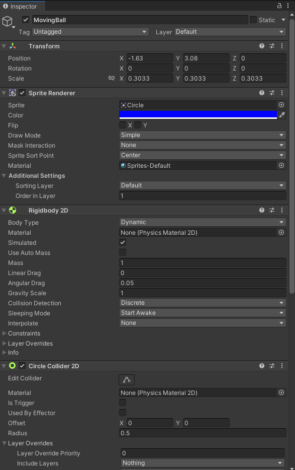

床のゲームオブジェクトにも当たり判定を追加しましょう。Rigidbody2Dは「物理で動く性質」、Collider2Dは「ぶつかる形」を与えるコンポーネントです。ボールと床の両方にCollider2Dがないと、見た目では重なっていても衝突しません。四角形のゲームオブジェクトには、Box Collider2Dがいいでしょう。
※似た名前のコンポーネントに、Box Colliderがありますが、2Dゲームを作る場合にはCollider**2D**を使います。

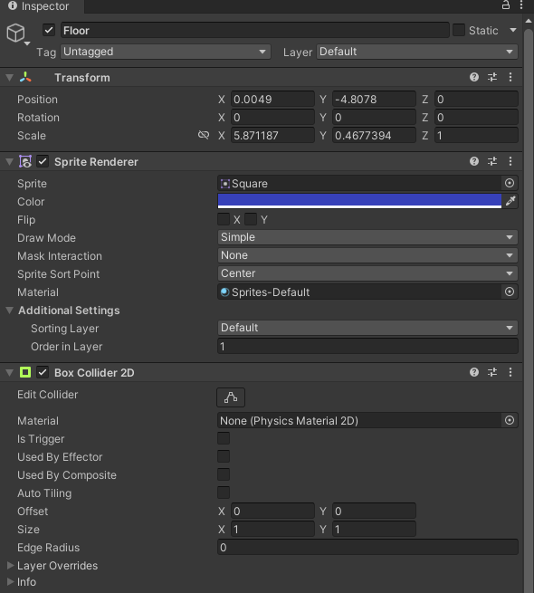

これで実行してみると、ボールが落下して床で止まるようになります。

他のゲームオブジェクトにもCollider2Dを追加して、当たり判定を付けてみましょう。最初からあるSquareのゲームオブジェクトのように、斜めになっていても当たり判定は正常に機能します。

### オブジェクトを回転させるコンポーネントをアタッチ
次はオブジェクトを回転させてみましょう。Squareに[RotateScript]コンポーネントをアタッチしてください。Squareが回転するようになります。

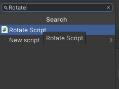

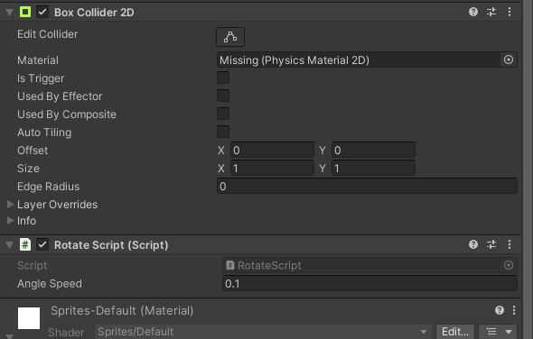

#### コンポーネントの設定値を変える
RotateScriptコンポーネントのAngle Speedを変更すると、回転する速度が変わります。
負の値にすると逆に回転します。

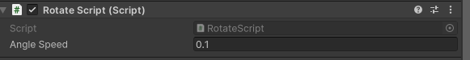

#### 回転するオブジェクトを追加しよう
新しくゲームオブジェクトを追加して、当たり判定と回転するコンポーネントをアタッチしてみましょう。

RotateScriptコンポーネントをゲームオブジェクトにアタッチすると、ゲームオブジェクトが回転するようになりました。

*（このコンポーネントはUnityに最初から組み込まれているコンポーネントではありません。最初にインポートしたテンプレートファイルに含まれていたものです。）*

次のチャプターでは、更に別のコンポーネントも使って、ピンボールゲームを作成していきましょう。

## ここまでできたらOK
- 再生するとボールが落下する
- ボールが床をすり抜けずに止まる
- RotateScriptを付けたオブジェクトが回転する

# Chapter 4 ピンボールゲームを作ろう

## この章のゴール
- スペースキーでボールを発射する仕組みを作る
- ゴールや障害物を配置する
- 衝突時に効果音を鳴らす

## このチャプターで行うこと
このチャプターでは、新たなゲームオブジェクトを作成し、コンポーネントをアタッチし、ピンボールゲームのステージを作成していきます。

## ボールを発射する
ピンボールゲームにするために、スペースキーを押すとボールを発射するようにします。
新しいゲームオブジェクト（2D Object⇒Sprite⇒Square）を作成して、Box Collider2DコンポーネントとCatapultScriptコンポーネントをアタッチします。CatapultScriptコンポーネントは、発射台やバネのように、衝突したオブジェクトを上方向へ押し出すコンポーネントです。このチュートリアルで用意しているCatapultScriptでは、時間経過で変化するオブジェクトのサイズが大きいほど、強い力で衝突したオブジェクトを上方向に突き上げる振る舞いをします。

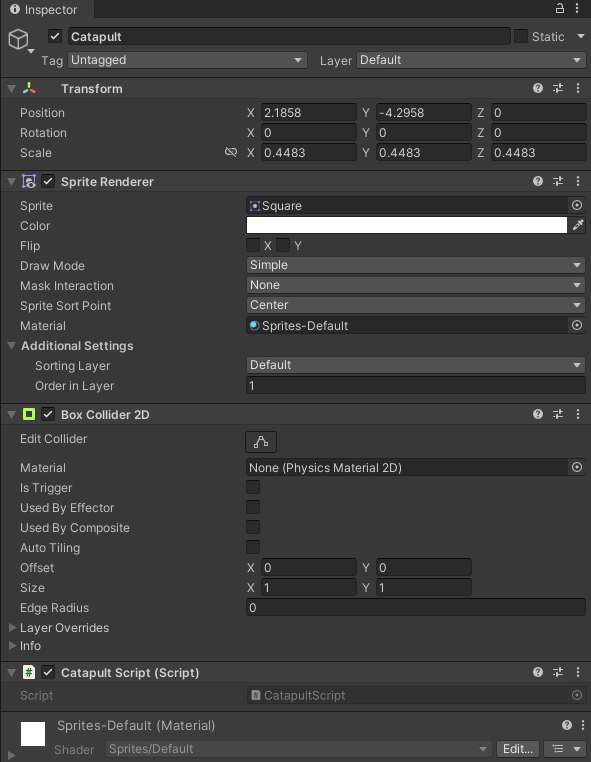

つぎに、MovingBallオブジェクトのRigidbody2DコンポーネントのGravity Scaleの値を0にします。これでMovingBallは自然落下しなくなります。

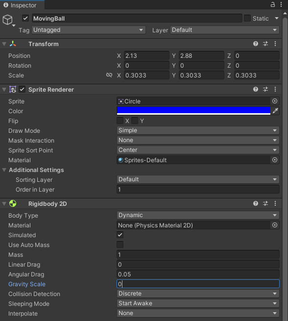

そして、MovingBallオブジェクトに、AddGravityPressSpaceScriptコンポーネントをアタッチします。AddGravityPressSpaceScriptコンポーネントは、スペースキーを押すと同じオブジェクトにアタッチされているRigidbody2DコンポーネントのGravity Scaleの値を1に変更するコンポーネントです。このコンポーネントをアタッチすると、MovingBallはスペースキーが押されるまでは空中にとどまり、スペースキーが押されると落下する挙動を取るようになります。

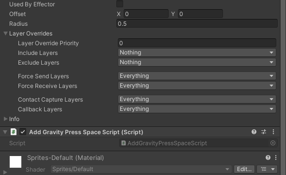

CatapultScriptコンポーネントをアタッチしたオブジェクトの上にMovingBallを配置してみましょう。
スペースキーを押すとMovingBallが落下、跳ね返ったMovingBallが上方のオブジェクトで跳ね返って左側に飛んでいくようになります。

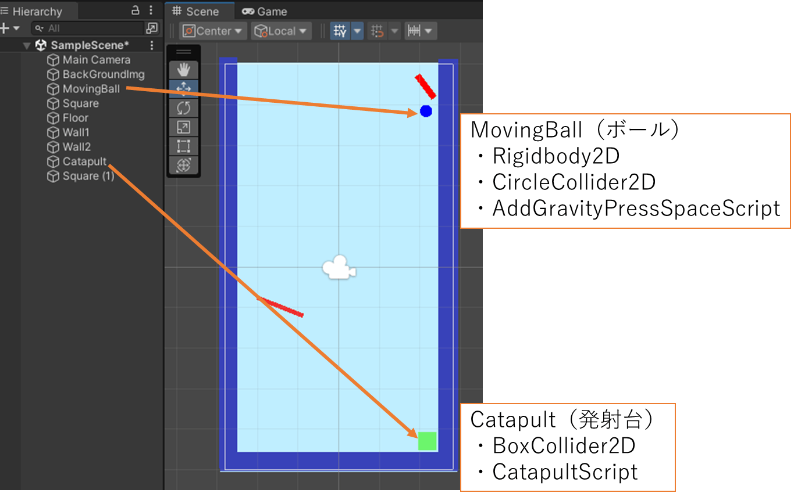

ボールを跳ね返す力は、CatapultScriptコンポーネントのAdd Force Valueで調整できます。
丁度いい強さになるように調整してみましょう。
※実行中に変更した値は、実行終了後に元に戻ってしまいます。気を付けましょう。

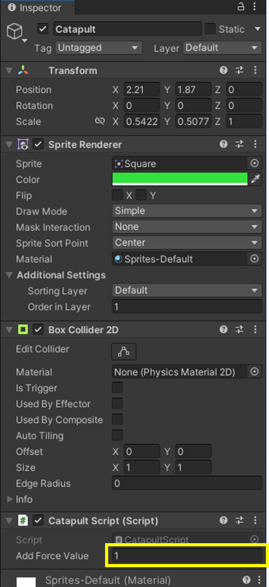

なんとなく、ピンボールゲームになりそうになってきましたね。

## ステージを作る
### ゴールを作成
それでは、ピンボールゲームのゴールを作って行きましょう。
2D Object⇒Sprite ⇒ Square で新しいゲームオブジェクトを作成し、床の上に配置します。

ここでは３つのゴールを作って、それぞれ色を変えています。

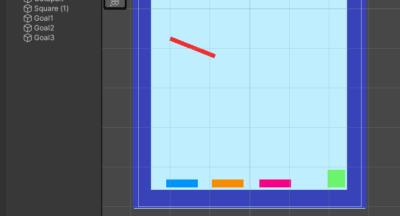

ゴールに入った後で外に飛び出されては困るので、ゴールを壁で囲みます。

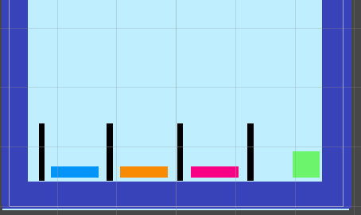

### 障害物を追加
小さいCircleを追加して、釘のようにしてみました。
スペースキーを押すタイミングによって入るゴールが変わるように調整してみましょう。

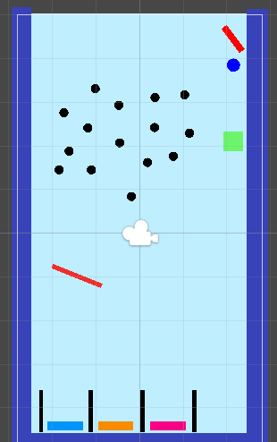

## 音を鳴らす
このままだと静かで寂しいですね。ゴールにボールが当たったら音を鳴らすようにしてみましょう。

### 何かが当たったら音を鳴らすコンポーネント
ゴールのオブジェクトに、[Audio Source]コンポーネントを追加しましょう。AudioSourceは、オブジェクトに音を鳴らさせるコンポーネントです。オブジェクトにCDプレイヤーを持たせるようなイメージです（CDプレイヤーは死語？）。

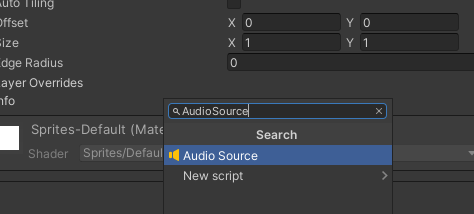

鳴らしたい音声データを用意してください。Unityで扱える音声データのファイル形式は、mp3, ogg, wav, aiff, mod, it, s3m, xmです（2024/2時点）。

音声ファイルの用意が出来たら、UnityEditorにファイルをインポートしましょう。

- プロジェクトウィンドウ内の何もない場所を右クリック

[Import New Assets]をクリック

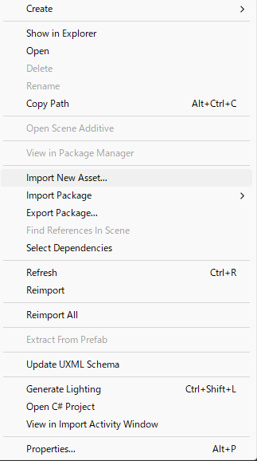

音声ファイルを選択

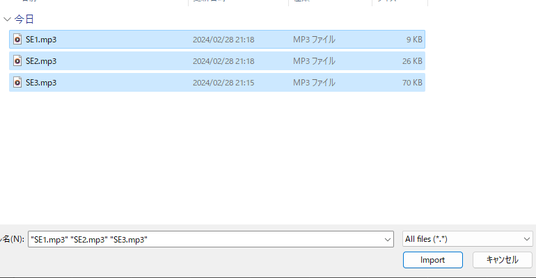

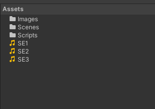

これで音声データを使うことが出来るようになりました。

先ほど、AudioSourceコンポーネントをアタッチしたゲームオブジェクトのインスペクターを開いて、Audio Clipに鳴らしたい効果音を設定します。これで、CDプレイヤーにCDがセットされた状態になりました。

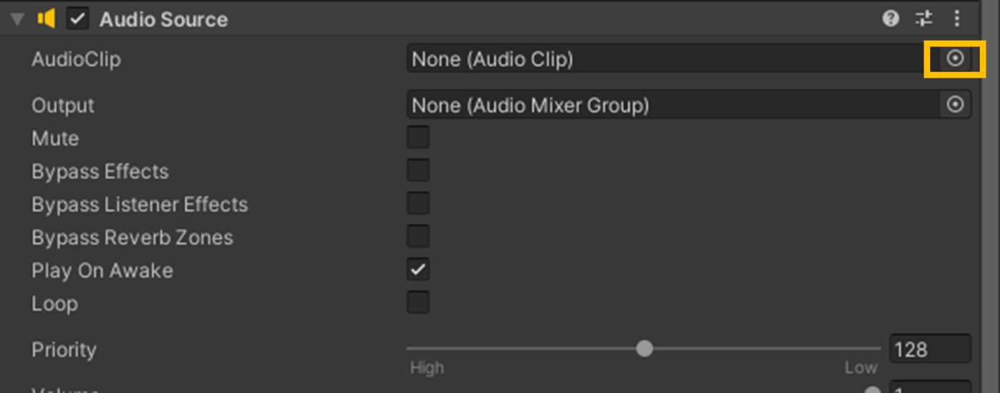

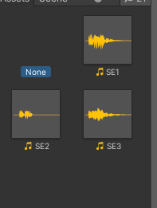

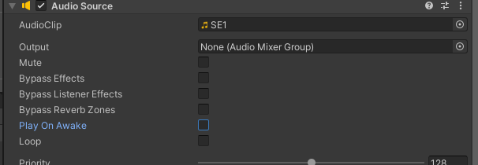

Play On Awakeのチェックは外しておきます。このチェックがついていると、ゲーム開始時に音が鳴ってしまうので、今回の目的には合いません。（ゲーム中のBGMを鳴らす場合にはONにしておくことが多い）

このままでは、音が鳴らないのでCDプレイヤーの再生ボタンを押してあげる必要があります。
そのためのコンポーネントをアタッチしましょう。

PlaySoundScriptコンポーネントは、ゲームオブジェクトに何かが当たったらゲームオブジェクトにアタッチされているAudioSourceのAudioClipを一度だけ再生する振る舞いをするコンポーネントです。

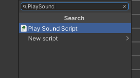

これで、ゴールにボールが入ったら音を鳴らせるようになりました。
他のゴールも音を鳴らせるようにしてみましょう。

もちろん、ゴール以外にもPlaySoundScriptコンポーネントをアタッチすれば音を鳴らせます。
色んなオブジェクトに音を鳴らす性質を与えてみましょう。

では、最後のチャプターに進みます。

## ここまでできたらOK
- スペースキーを押すとボールが落下し、発射台で跳ね返る
- 複数のゴールや障害物を配置できている
- ゴールにボールが当たったときに効果音が鳴る

# Chapter 5 ピンボールゲームを完成させよう

## この章のゴール
- 使えるコンポーネントを整理する
- ゲームオブジェクトを複製・階層化して管理する
- 画像やBGMを使ってゲームを作り込む

## このチャプターで行うこと
このチャプターでは、ピンボールゲームのステージを完成させます。
- ヒエラルキーでゲームオブジェクトを作成する
- ゲームオブジェクトの移動、サイズ変更、角度変更
- ゲームオブジェクトにコンポーネントをアタッチ
ここまで学んできたことを思い出して、ゲームオブジェクトを作る、配置する、コンポーネントをアタッチする、一連の流れをストレスなく行えるまで手に覚えこませましょう。

## その他のコンポーネント
ここまで使ってきたコンポーネント、それ以外にテンプレートに入れているコンポーネントを紹介します。ここで文章省略のために、「自身」としているところは、「そのコンポーネントをアタッチしたオブジェクト」と読んでください。
- Rigidbody2D：自身に物理演算を適用する
- CircleCollider2D：自身に円形の衝突判定を適用する
- BoxCollider2D：自身に四角形の衝突判定を適用する
- AudioSource：自身に音を再生する機能を与える
- RotateScript：自身に、自身が回転し続ける振る舞いを与える
- PlaySoundScript：自身に何かが衝突したときに、自身にアタッチされているAudioSourceコンポーネントを再生する
- CatapultScript：自身に衝突したオブジェクトに対して、上方向の力を加える、加える力はオブジェクトのサイズによって変わる
- AddGravityPressSpaceScript：スペースキーを押したときに、自身がRigidbody2Dコンポーネントを持っていたら、そのGravityScaleを1にする（つまり、落下するようになる）

ここからは未使用のコンポーネント
- AddForceBlockScript：自身に衝突したオブジェクトに対して力を加える。加える力はx, yの2軸で指定可能。
- AddForceBlockToForwardScript：自身に衝突したオブジェクトに対して、自身の右方向の力を加える
- ChangeColorScript：自身に何かが衝突したときに、自身の色を指定された色に変える（自身のSpriteRendererコンポーネントのColorの値を変更する）
- ChangeImageScript：自身に何かが衝突したときに、自身の画像を指定された画像に変更する（自身のSpriteRendererコンポーネントのSpriteを変更する）
- RotateAtOnceScript：自身に何かが衝突したときに、指定された角度だけ回転する。RotateScriptコンポーネントとは違い、衝突した時に一度だけ回転する。

ここで紹介してきたコンポーネントについて注意があります。
この中でUnityに標準で組み込まれているコンポーネントは、Rigidbody2D、CircleCollider2D、BoxCollider2Dの3つだけです。他のコンポーネントは最初にインポートしたテンプレートに含まれていたもので、インポートしないと使うことが出来ません。

区別するために、全てに～～Scriptと付けています。これらは、C#というプログラミング言語で記述されたスクリプトファイルで、自分でカスタムしたコンポーネントを作ることが出来ます。

### スクリプトファイルを見てみよう
一つ、スクリプトファイルを開いてみましょう。
プロジェクトウィンドウで[Assets]⇒[Scripts]⇒[Tutorial01]と開いて、[RotateScript]をダブルクリックしてみてください。

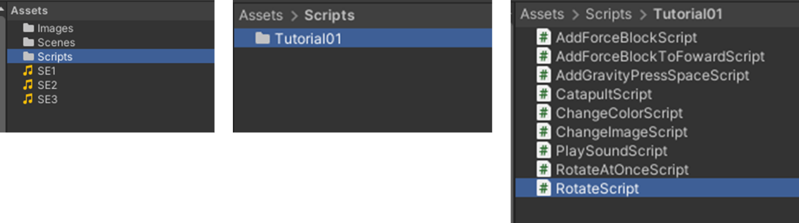

RotateScriptに記述されている内容を見ることが出来ます。
※何か書き込んでエラーを出さないように気を付けましょう。

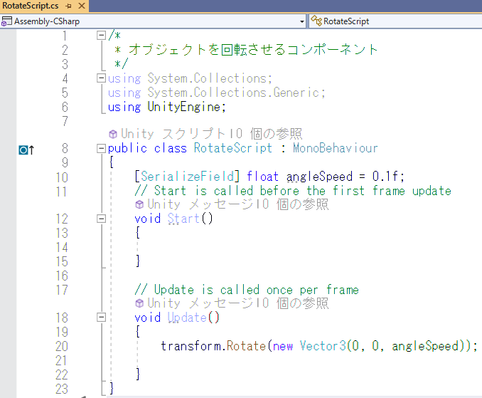

このスクリプトはこのチュートリアル用に用意したもので、作成時に自動で生成されるコードを除けば、書いたコードは10行目と20行目の２行だけです。1行2行程度のプログラムでも、案外色々なことが出来ます。

最終的に、
自分のしたいことに合わせて、
それを実現可能なスクリプトを書いて、カスタムコンポーネントを作り、
それをゲームオブジェクトにアタッチして様々な振る舞いを実現する。

今はまだ意味が分からないかも知れませんが、チュートリアルを進めるうちにスクリプトを自分で作って書けるようになっていきます。（自分でカスタムコンポーネントを作れるようになったら初心者卒業です）

自分でスクリプト（プログラム）を書くことが出来るようになると、Unityで出来ることの幅が大きく広がります。しかし、まずはゲームオブジェクトの振る舞いを決めているのがコンポーネントであり、アタッチするコンポーネントの組み合わせによってゲームオブジェクトが様々な振る舞いを取っていることを理解しましょう。

## ピンボールゲームを完成させよう
では、他のコンポーネントも使って、ピンボールゲームを作りこんでいきましょう。
その前に、作業を楽にするための豆知識をいくつか紹介します。

### ゲームオブジェクトの階層化
ゲームオブジェクトが増えてくると、管理が大変になりますね。
壁やクギなど、同じカテゴリのゲームオブジェクトはまとめて管理することが出来ます。

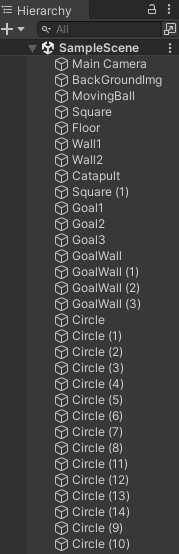

ヒエラルキーに空のゲームオブジェクトを一つ追加します。
＋ボタン⇒Create Empty

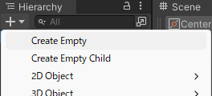

出来たゲームオブジェクトの名前を変更して、分かりやすくします。フォルダーを作るイメージです。
そして、空のゲームオブジェクトに同じカテゴリのゲームオブジェクトをドラッグ＆ドロップします。これでまとめていくとヒエラルキーをすっきりさせることが出来ます。

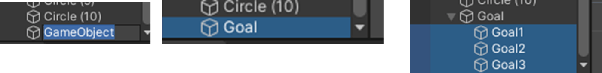

折りたたむとかなり見やすくなりますね。

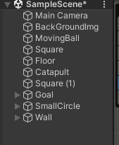

### ゲームオブジェクトの複製
既にヒエラルキーにあるゲームオブジェクトは、コピーすることが出来ます。
ゲームオブジェクトをコピーするには、コピー元にしたいゲームオブジェクトを選択してCopyし、ヒエラルキー上の何もない場所を右クリックして、Pasteをクリックします。

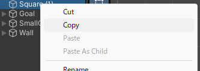

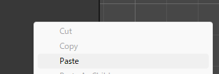

複製を作成する場合には、Duplicateを選べばコピーとペーストが同時に行えます。

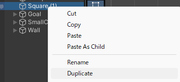

複製やコピーしたオブジェクトは、元のオブジェクトに重なっている状態になっているので、位置を動かしてあげましょう。

コピーしたオブジェクトには、元のオブジェクトと同じコンポーネントがついている状態になります。

### Spriteに画像を貼り付ける
Spriteコンポーネントを持つオブジェクト（Sprite⇒Circle等で作成したオブジェクト）には、画像を貼り付けることが出来ます。

インスペクターのSprite RendererのSpriteの場所（下の画像でSquareとなっている場所）に、画像をドラッグ＆ドロップします。

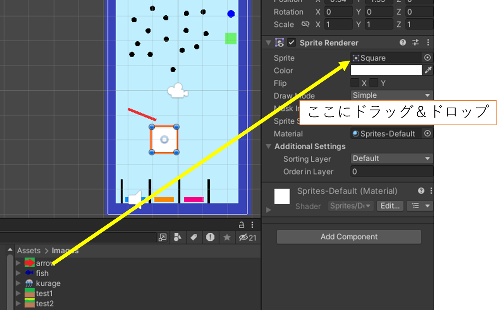

これで画像を表示することが出来ました。
音声ファイルをインポートしたときと同じようにして、画像ファイルをインポートすれば、自分の好きな画像をゲーム中に登場させることが出来ます。

ChangeImageScriptコンポーネントを使用する場合には、インスペクターのChangeImageScriptコンポーネントのChangeSpriteにも画像を設定しておく必要があります。
（何かが衝突したら、設定した画像に切り替わる）

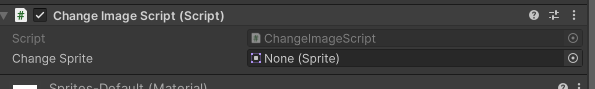

### 背景BGMを流す
ゲーム中、好きな音楽を再生したい場合は、適当なゲームオブジェクトにAudioSourceコンポーネントをアタッチして、AudioClipに再生したい音楽を設定します。
Play On AwakeとLoopのチェックを入れておけば、ゲーム開始時からゲーム終了まで同じ音楽をループ再生することが出来ます。もちろん、BGMとして再生する音声ファイルはある程度長いものを選びましょう。

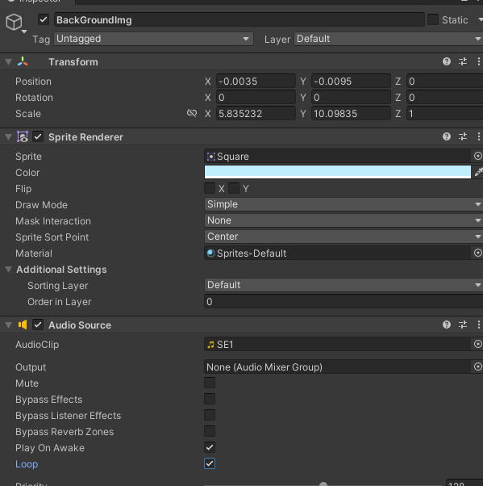

## しっかり完成させよう
出来ることに制限がある状態ですが、今あるコンポーネントを組み合わせるだけでも面白いものに出来るはずです。中途半端で終わらせるのではなく、他の人に遊んでもらえるようにしっかり作りこんでみましょう。

## おわりに
Unityでの最初のゲーム完成、おめでとうございます。
出来ることがまだ少なくて、満足のいく出来にはならないかもしれません。
例えば、得点が入らない、一回弾を発射したら終わってしまう、パドルのように上下に動く動きをさせたい、、、色んな不満が出てくると思います。

出てきた不満をメモしておいて、後でもう一度このピンボールゲームに戻ってみましょう。スクリプトを書いてカスタムコンポーネントを作る、これが出来るようになってから戻ってくれば、もっといいゲームに出来るはずです。

## ここまでできたらOK
- ヒエラルキー上でオブジェクトを整理できている
- 複製したオブジェクトを使ってステージを作り込めている
- 他の人が遊べる状態を目指して調整できている
